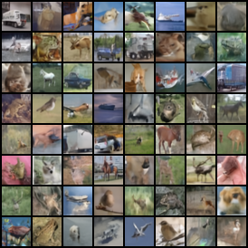
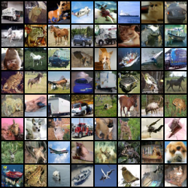

# flow-matching-pytorch

## 🛠️ Installation

> The code is tested with python 3.12, torch 2.4.1 and cuda 12.4.

Clone this repo:

```shell
git clone https://github.com/xyfJASON/flow-matching-pytorch.git
cd flow-matching-pytorch
```

Create and activate a conda environment:

```shell
conda create -n flow python=3.12
conda activate flow
```

Install dependencies:

```shell
pip install torch==2.4.1 torchvision==0.19.1 --index-url https://download.pytorch.org/whl/cu124
pip install -r requirements.txt
```

<br/>

## 🔥 Training

```shell
accelerate-launch train.py -c CONFIG [-e EXPDIR] [-mp MIXED_PRECISION]
```

- `CONFIG`: Path to the configuration file, e.g., `./configs/cifar10.yaml`.
- `EXPDIR`: Path to the experiment directory. Default: `./runs/<current_time>`.
- `MIXED_PRECISION`: Use mixed precision training. Options: 'no', 'fp16', 'bf16'.

<br/>


## 🚀 Sampling

```shell
accelerate-launch sample.py -c CONFIG \
                            --weights WEIGHTS \
                            --n_samples N_SAMPLES \
                            --save_dir SAVEDIR \
                            [--sampling_steps SAMPLING_STEPS] \
                            [--bspp BATCH_SIZE_PER_PROCESS] \
                            [-seed SEED]
```

- `CONFIG`: Path to the configuration file, e.g., `./configs/cifar10.yaml`.
- `WEIGHTS`: Path to the model weights, e.g., `./runs/expdir/ckpt/stepxxxx/model_ema.pt`.
- `N_SAMPLES`: Number of samples to generate.
- `SAVEDIR`: Path to the directory to save the samples.
- `SAMPLING_STEPS`: Number of steps to sample. Default: 100.
- `BATCH_SIZE_PER_PROCESS`: Batch size per process. Default: 100.
- `SEED`: Random seed. Default: 8888.

<br/>


## 🎨 Results (CIFAR-10)

**Note**: The model is trained for only 200k steps (iterations).

**Quantitative results**:

| EMA Model |     Sampler      |   FID ↓   |
|:---------:|:----------------:|:---------:|
|    Yes    | Euler 1000 steps |   7.47    |
|    Yes    | Euler 100 steps  |   7.73    |
|    Yes    |  Euler 10 steps  |   19.37   |
|    No     | Euler 1000 steps |   8.38    |
|    No     | Euler 100 steps  |   8.62    |
|    No     |  Euler 10 steps  |   20.14   |

**Visual results**:

|             Euler 10 steps              |             Euler 100 steps              |             Euler 1000 steps              |
|:---------------------------------------:|:----------------------------------------:|:-----------------------------------------:|
|    |    |    |

<br/>


## 🖋️ References

Flow Matching:

```
@inproceedings{lipman2023flow,
  title={Flow Matching for Generative Modeling},
  author={Yaron Lipman and Ricky T. Q. Chen and Heli Ben-Hamu and Maximilian Nickel and Matthew Le},
  booktitle={The Eleventh International Conference on Learning Representations },
  year={2023},
  url={https://openreview.net/forum?id=PqvMRDCJT9t}
}
```

Rectified Flow:

```
@inproceedings{liu2023flow,
  title={Flow Straight and Fast: Learning to Generate and Transfer Data with Rectified Flow},
  author={Xingchao Liu and Chengyue Gong and qiang liu},
  booktitle={The Eleventh International Conference on Learning Representations },
  year={2023},
  url={https://openreview.net/forum?id=XVjTT1nw5z}
}
```