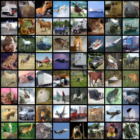
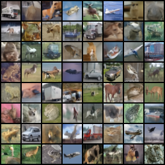
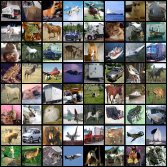
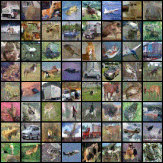

# flow-matching-pytorch

Implement Flow Matching with PyTorch.

<br/>


## Installation

> The code is tested with python 3.12, torch 2.4.1 and cuda 12.4.

Clone this repo:

```shell
git clone https://github.com/xyfJASON/flow-matching-pytorch.git
cd flow-matching-pytorch
```

Create and activate a conda environment:

```shell
conda create -n flow python=3.12
conda activate flow
```

Install dependencies:

```shell
pip install torch==2.4.1 torchvision==0.19.1 --index-url https://download.pytorch.org/whl/cu124
pip install -r requirements.txt
```

<br/>


## Training

```shell
accelerate-launch train.py -c CONFIG [-e EXPDIR] [-mp MIXED_PRECISION]
```

- `-c`: Path to the configuration file, e.g., `./configs/cifar10.yaml`.
- `-e`: Path to the experiment directory. Default: `./runs/<current_time>`.
- `-mp`: Use mixed precision training. Options: 'no', 'fp16', 'bf16'.

<br/>


## Sampling

```shell
accelerate-launch sample.py -c CONFIG \
                            --weights WEIGHTS \
                            --n_samples N_SAMPLES \
                            --save_dir SAVE_DIR \
                            [--sampling_steps SAMPLING_STEPS] \
                            [--sampling_method SAMPLING_METHOD] \
                            [--bspp BATCH_SIZE_PER_PROCESS] \
                            [-seed SEED]
```

- `-c`: Path to the configuration file, e.g., `./configs/cifar10.yaml`.
- `--weights`: Path to the model weights, e.g., `./runs/expdir/ckpt/stepxxxx/model_ema.pt`.
- `--n_samples`: Number of samples to generate.
- `--save_dir`: Path to the directory to save the samples.
- `--sampling_steps`: Number of steps to sample. Default: 100.
- `--sampling_method`: Sampling method. Default: 'euler'.
- `--bspp`: Batch size per process. Default: 100.
- `--seed`: Random seed. Default: 8888.

<br/>


## Results (CIFAR-10)

**Note**: The model is trained for only 200k steps (iterations).

**Quantitative results**:

| EMA Model |     Sampler      | NFE  | FID ↓ |
|:---------:|:----------------:|:----:|:-----:|
|    Yes    | Euler 1000 steps | 1000 | 7.74  |
|    Yes    | Euler 100 steps  | 100  | 7.98  |
|    Yes    |  Euler 10 steps  |  10  | 19.72 |
|    Yes    |  Heun 500 steps  | 1000 | 7.76  |
|    Yes    |  Heun 50 steps   | 100  | 9.15  |
|    Yes    |   Heun 5 steps   |  10  | 116.7 |

**Visual results**:

<table style="text-align: center">
<tr>
    <th>Euler 1000 steps</th>
    <th>Euler 100 steps</th>
    <th>Euler 10 steps</th>
</tr>
<tr>
    <td></td>
    <td></td>
    <td></td>
</tr>
<tr>
    <th>Heun 500 steps</th>
    <th>Heun 50 steps</th>
    <th>Heun 5 steps</th>
</tr>
<tr>
    <td></td>
    <td></td>
    <td></td>
</tr>
</table>

<br/>


## References

Flow Matching:

```
@inproceedings{lipman2023flow,
  title={Flow Matching for Generative Modeling},
  author={Yaron Lipman and Ricky T. Q. Chen and Heli Ben-Hamu and Maximilian Nickel and Matthew Le},
  booktitle={The Eleventh International Conference on Learning Representations },
  year={2023},
  url={https://openreview.net/forum?id=PqvMRDCJT9t}
}
```

Rectified Flow:

```
@inproceedings{liu2023flow,
  title={Flow Straight and Fast: Learning to Generate and Transfer Data with Rectified Flow},
  author={Xingchao Liu and Chengyue Gong and qiang liu},
  booktitle={The Eleventh International Conference on Learning Representations },
  year={2023},
  url={https://openreview.net/forum?id=XVjTT1nw5z}
}
```